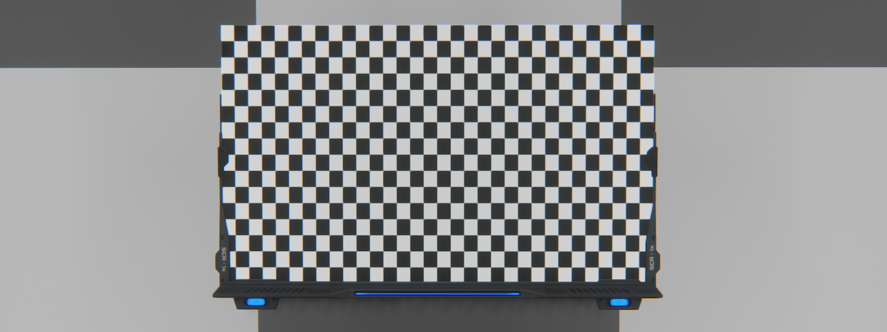
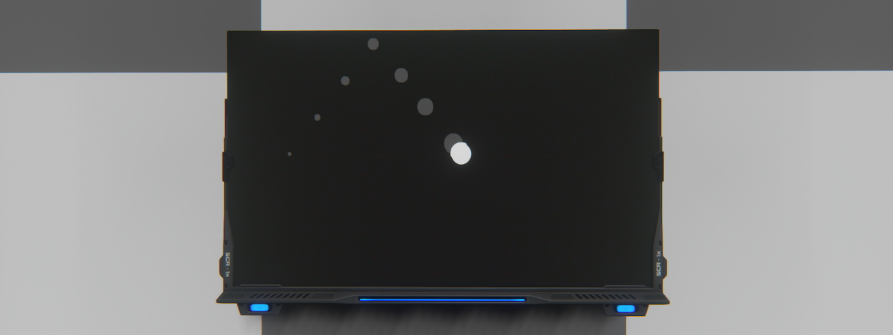

# Lua screen basic examples
These examples are simple examples of using Lua screens. They are intended to show basic use cases.

## Simple text

### Description
- One of the first things you will want to do on a Lua screen is to display text! So here is an example of how to simply display pieces of text on the screen.
Note that in this example we are writing lines from a hard-coded array of lines, but you have a `getTextWrapped` function in the `rslib` library to split your text according to a width limit.
### Requirements
- A single screen will suffice.
### Installation
- Simply copy the code from the lua file [render_simpleText.lua](render_simpleText.lua) into the screen content.

## Checkerboard

### Description
- An example of use to repeat a pattern or shape across the screen.
### Requirements
- A single screen will suffice.
### Installation
- Simply copy the code from the lua file [render_checkerboard.lua](render_checkerboard.lua) into the screen content.

## Bouncing ball

### Description
- Animation is a whole area of use for Lua screens. This example shows you how to animate a simple ball with a track, bouncing off the edges of the screen.
### Requirements
- A single screen will suffice.
### Installation
- Simply copy the code from the lua file [render_bouncingBall.lua](render_bouncingBall.lua) into the screen content.
