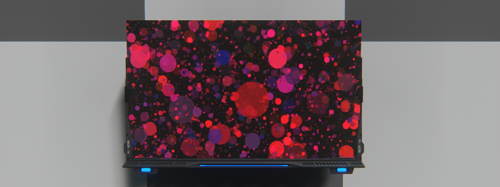

# Lua screen advanced examples
These examples are advanced examples of using Lua screens. They are intended to show a more complex use than the previous one.

## Simple text

### Description
- One of the first things you will want to do on a Lua screen is to display text! So here is an example of how to simply display pieces of text on the screen.
### Requirements
- A single screen will suffice.
### Installation
- Simply copy the code from the lua file [render_entropy.lua](render_entropy.lua) into the screen content.

## Checkerboard

### Description
- An example of use to repeat a pattern or shape across the screen.
### Requirements
- A single screen will suffice.
### Installation
- Simply copy the code from the lua file [render_radialMenu.lua](render_radialMenu.lua) into the screen content.
