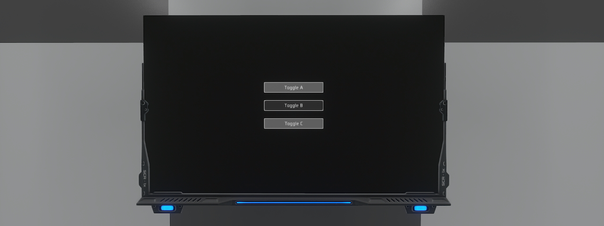

# Lua screen widget examples
These examples are examples of ui widgets done with Lua screens. They are intended to show you some typical object structure for interfaces.

## Slider widgets

### Description
- An example of a cursor widget made in pure Lua to allow you to define values in a range of values. In this case, it allows you to control the background color.
### Requirements
- A single screen will suffice.
### Installation
- Simply copy the code from the lua file [render_slider.lua](render_sliders.lua) into the screen content.

## Toggle buttons

### Description
- An example of a toggle button, a useful widget element for interface design in Lua. In this case, the use of a toggle button we recommend its status in the Lua chat.
### Requirements
- A single screen will suffice.
### Installation
- Simply copy the code from the lua file [render_toggle.lua](render_toggle.lua) into the screen content.
