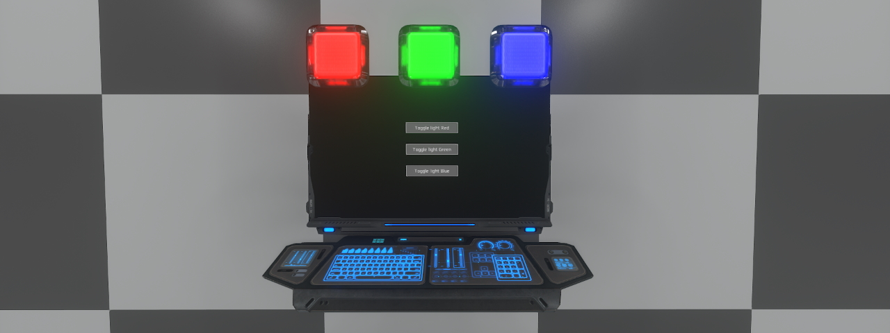

# Lua Screen Interaction
These examples are intended to show you how to do interactions between screens and other elements.

## Light Control

### Description
- This example shows you a concrete use of an interface widget developed for this example; a button. In this case, it will show you one of the many ways to interact with other elements using a screen unit and a programming board.
### Requirements
- You will need:
  - A programming board
  - A screen unit
  - 3 lights (Square XS in the visual but do as you wish)
### Installation
- Firstly, for the screen unit part:
  - Place the screen unit.
  - Copy and paste the [render.lua](render.lua) into the screen content in Lua mode.
- Place the programming board.
- Then, link the three lights and screen to the programming board with the link tool.
- Finaly, paste the [controlunit.json](controlunit.json) file on your programming board with contextual menu, OR proceed manualy as below:
  - Edit the Lua content of the programming board
  - Name the slots in the Lua editor of the programming board as `lightRed`, `lightGreen`,`lightBlue` and finaly, the screen as `screen`.
  - Create an onStart filter in the unit slot.
  - Paste the content of [unit_onStart.lua](unit_onStart.lua) code in.
  - Create an onOutputChanged filter in the screen slot. Set the output argument as `*` (whitecard on filters).
  - Paste the content of [screen_onOutputChanged.lua](screen_onOutputChanged.lua) code in.

