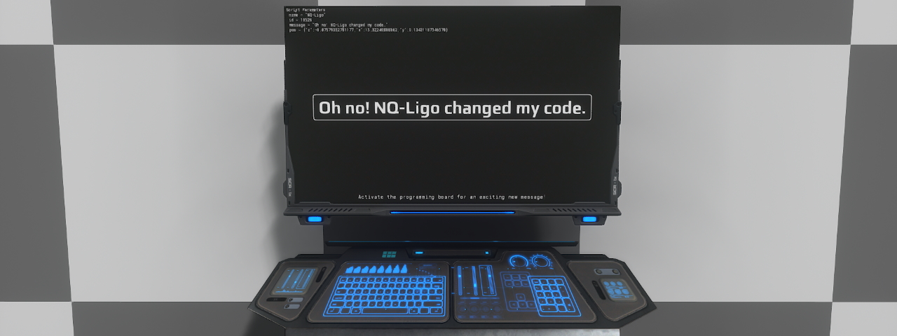

# Lua Screen Random Message
## Slider widgets

### Description
- This example shows you another way of interacting between a screen unit and other elements. But this time we will do the opposite of the previous example [Lua Screen Light Control](https://github.com/dual-universe/lua-examples/tree/main/examples/04%20-%20Lua%20Screen%20Light%20Control). To be clear, in this case we are going to show you how to interact between the programming board and the screen by sending it a message and the player username.

### Requirements
- You will need:
  - A programming board
  - A screen unit
### Installation
- Firstly, for the screen unit part:
  - Place the screen unit.
  - Copy and paste the [render.lua](render.lua) into the screen content in Lua mode.
- Finaly, for the programming board
  - Place the programming board.
  - Link the screen unit to the programming board and name its slot in the Lua editor as `screen`.
  - Create a start filter in the unit slot.
  - Paste the content of [unit_start.lua](unit_start.lua) code in.
  - Create a mouseDown filter in the screen slot. Set the mx and my arguments as `*` and `*`.
  - Paste the content of [screen_mouseDown.lua](screen_mouseDown.lua) code.

