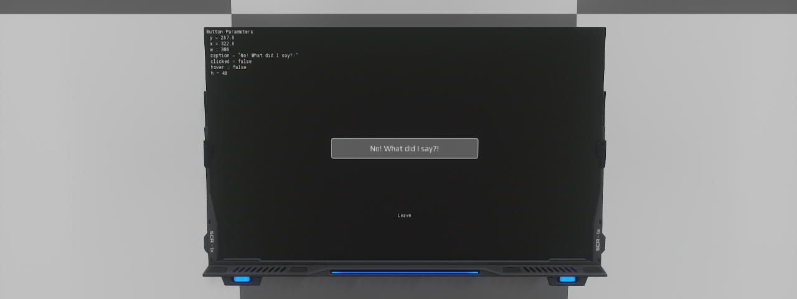

# NQ Lua libraries
## Event library on screen

### Description
- Interactivity is a key point in using the screens. For this you could tackle several different strategies, however to help the less experienced we have added a Lua library to the game.
This library is intended to provide a simple integration of events covering various uses. In this case, you will see a modified version of the button example made in [Lua Screen Light Control](https://github.com/dual-universe/lua-examples/tree/main/examples/04%20-%20Lua%20Screen%20Light%20Control), to include events such as :
  - onPressed: triggered when the button is pressed
  - onDown: triggered when the button is hold down
  - onReleased: triggered when the button is released
  - onHover: triggered when the button is hovered
  - onLeave: triggered when the button is leave

### Requirements
- You will need:
  - A screen unit
### Installation
- For the screen unit part:
  - Place the screen unit.
  - Copy and paste the [render.lua](render.lua) into the screen content in Lua mode.

Optionnal: Do not hesitate to check the event library in your game file folder, under `data/lua/utils`.

