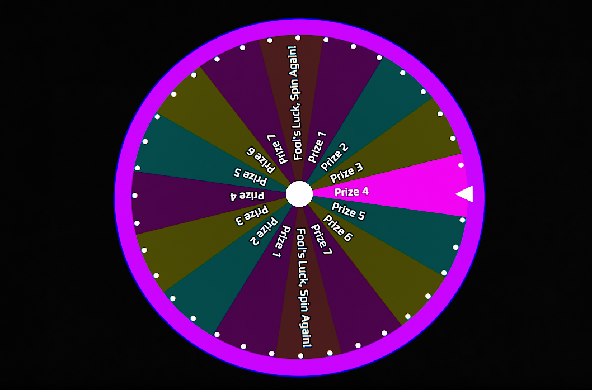

# Lua Wheel of Foolish Fortune
This example is for the implementation of the wheel of foolish fortune that was used during an event in 2022.
It utilizes various different techniques, such as:
- Generating a random number and a table of prizes which are sent to the screen unit when the programming board is run.
- Rotating layers containing the prizes and panels.
- Several trigonometry tricks to position objects in a ring, similar to for example the radial menu.
- Not overusing the requestAnimationFrame by stopping animation requests once the wheel has stopped moving.

## Wheel of Foolish Fortune

### Description
- This provides a little wheel that players can use for handing out prizes.

### Requirements
- You will need:
  - A programming board
  - A screen unit
### Installation
- Firstly, for the screen unit part:
  - Place the screen unit.
  - Copy and paste the [render.lua](render.lua) into the screen content in Lua mode.
- Place the programming board.
- Then, link the screen to the programming board with the link tool.
- Finaly, paste the [controlunit.json](controlunit.json) file on your programming board with contextual menu, OR proceed manualy as below:
  - Edit the Lua content of the programming board
  - Name the screen slot in the Lua editor of the programming board as `screen`.
  - Create an onStart filter in the unit slot.
  - Paste the content of [unit_onStart.lua](unit_onStart.lua) code in.

