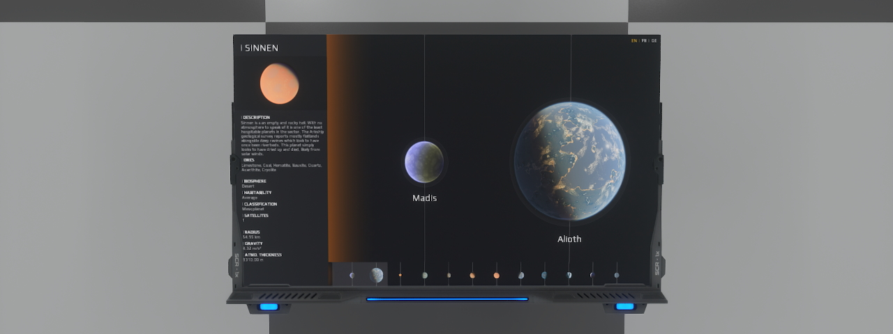

# Complete examples
These examples are examples of concrete application of libraries implemented by Novaquark. They are intended to show you how to use them.

## Atlas Library Screen

### Description
- After a few simple and practical examples, this is the first example of a complete system; an Atlas screen.
This screen allows you to display information about the stellar bodies in the Helios system. This is a concrete example of the use of all the previous examples

### Requirements
- You will need:
  - A screen unit
### Installation
- For the screen unit part:
  - Place the screen unit.
  - Copy and paste the [render.lua](render.lua) into the screen content in Lua mode.

Optionnal: You can try to connect a programming board to it and send in input the player position to display the distance to the stellar body in its properties ;) 

